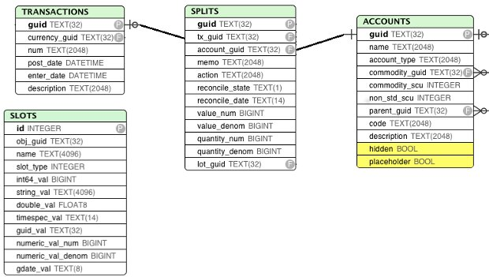
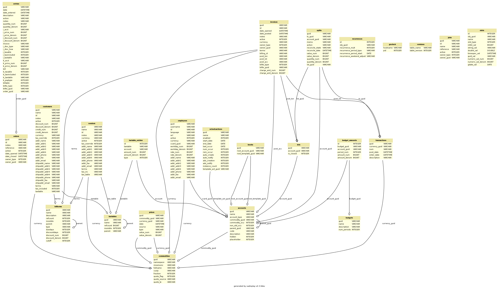

GnuCash SQL Object model and schema
===================================

Book
----

Таблица books. В базе данных может быть только одна книга::

    CREATE TABLE books (
        guid                CHAR(32) PRIMARY KEY NOT NULL,
        root_account_guid   CHAR(32) NOT NULL,
        root_template_guid  CHAR(32) NOT NULL
    );

Поля:

root_account (mandatory)
   The account at the root of the tree structure
root_template (mandatory)
   Use to attach split from template/scheduled transactions

Commodity
---------
::

    CREATE TABLE commodities (
        guid            CHAR(32) PRIMARY KEY NOT NULL,
        namespace       text(2048) NOT NULL,
        mnemonic        text(2048) NOT NULL,
        fullname        text(2048),
        cusip           text(2048),
        fraction        integer NOT NULL,
        quote_flag      integer NOT NULL,
        quote_source    text(2048),
        quote_tz        text(2048)
    );

A Commodity is either a currency (€, $, ...) or a commodity/stock that can be stored in/traded
 through an Account.

The Commodity object is used in two different (but related) contexts.

 - each Account should specify the Commodity it handles/stores.
   For usual accounts (Savings, Expenses, etc), the Commodity is a currency.
   For trading accounts, the Commodity is usually a stock (AMZN, etc).
   In this role, each commodity (be it a stock or a currency) can have Prices attached to it that
   give the value of the commodity expressed in a given currency.
 - each Transaction should specify the Currency which is used to balance itself.

Fields

namespace (mandatory)
    A string representing the group/class of the commodity. All commodities that are currencies should have ‘CURRENCY’ as namespace. Non currency commodities should have other groups.
mnemonic (mandatory)
    The symbol/stock sticker of the commodity (relevant for online download of quotes)
fullname
    The full name for the commodity. Besides the fullname, there is a “calculated property” unique_name equal to “namespace::mnemonic”
cusip
    unique code for the commodity
fraction
    The smallest unit that can be accounted for (for a currency, this is equivalent to the scu, the smallest currency unit) This is essentially used for a) display and b) roundings
quote_flag
    True if Prices for the commodity should be retrieved for the given stock. This is used by the “quote download” functionnality.
quote_source
    The source for online download of quotes

Invariant

        a currency commodity has namespace==’CURRENCY’
        only currencies referenced by accounts or commodities are stored in the table ‘commodities’
        (the complete list of currencies is available within the GnuCash application)
        a stock commodity has namespace!=’CURRENCY’

Account
-------
::

    CREATE TABLE accounts (
        guid            CHAR(32) PRIMARY KEY NOT NULL,
        name            text(2048) NOT NULL,
        account_type    text(2048) NOT NULL,
        commodity_guid  CHAR(32) NOT NULL,
        commodity_scu   integer NOT NULL,
        non_std_scu     integer NOT NULL,
        parent_guid     CHAR(32),
        code            text(2048),
        description     text(2048)
    );

An account tracks some commodity for some business purpose. Changes in the commodity amounts are modelled through Splits (see Transaction & Splits).
Fields

type (mandatory)
    the type of the account as string
commodity (mandatory)
    The commodity that is handled by the account
parent (almost mandatory)
    the parent account to which the account is attached. All accounts but the root_account should have a parent account.
commodity_scu (mandatory)
    The smallest currency/commodity unit is similar to the fraction of a commodity. It is the smallest amount of the commodity that is tracked in the account. If it is different than the fraction of the commodity to which the account is linked, the field non_std_scu is set to 1 (otherwise the latter is set to 0).
name
    self-explanatory
description
    self-explanatory
placeholder
    if True/1, the account cannot be involved in transactions through splits (ie it can only be the parent of other accounts). if False/0, the account can have Splits referring to it (as well as be the parent of other accounts). This field, if True, is also stored as a Slot under the key “placeholder” as a string “true”.
hidden
    to be investigated

Invariant

        if placeholder, no new splits can be created/changed (like a “freeze”)
        only two accounts can have type ROOT (the root_account and the root_template of the book).
        the type of an account is constrained by the type of the parent account
        trading account are used when the option “use trading accounts” is enabled

Transaction & Splits
--------------------

::

    CREATE TABLE transactions (
        guid            CHAR(32) PRIMARY KEY NOT NULL,
        currency_guid   CHAR(32) NOT NULL,
        num             text(2048) NOT NULL,
        post_date       timestamp NOT NULL,
        enter_date      timestamp NOT NULL,
        description     text(2048)
    );

    CREATE TABLE splits (
        guid            CHAR(32) PRIMARY KEY NOT NULL,
        tx_guid         CHAR(32) NOT NULL,
        account_guid    CHAR(32) NOT NULL,
        memo            text(2048) NOT NULL,
        action          text(2048) NOT NULL,
        reconcile_state text(1) NOT NULL,
        reconcile_date  timestamp NOT NULL,
        value_num       integer NOT NULL,
        value_denom     integer NOT NULL,
        quantity_num    integer NOT NULL,
        quantity_denom  integer NOT NULL,
        lot_guid        CHAR(32)
    );

The transaction represents movement of money between accounts expressed in a given currency (the currency of the transaction). The transaction is modelled through a set of Splits (2 or more). Each Split is linked to an Account and gives the increase/decrease in units of the account commodity (quantity) related to the transaction as well as the equivalent amount in currency (value). For a given transaction, the sum of the split expressed in the currency (value) should be balanced.
Fields for Transaction

currency (mandatory)
    The currency of the transaction
num (optional)
    A transaction number (only used for information ?)
post_date (mandatory)
    self-explanatory. This field is also stored as a slot under the date-posted key (as a date instead of a time)
enter_date (mandatory)
    self-explanatory
description (mandatory)
    self-explanatory

Fields for Split

tx (mandatory)
    the transaction of the split
account (mandatory)
    the account to which the split refers to
value (mandatory)
    the value of the split expressed in the currency of the transaction
quantity (mandatory)
    the change in quantity of the account expressed in the commodity of the account
reconcile information
    to be filled
lot
    reference to the lot (to be investigated)

Invariant

        the sum of the value on all splits in a transaction should = 0 (transaction is balanced). If it is not the case, the GnuCash application create automatically an extra Split entry towards the Account Imbalance-XXX (with XXX the currency of the transaction)
        the value and quantity fields are expressed as numerator / denominator. The denominator of the value should be the same as the fraction of the currency. The denominator of the quantity should be the same as the commodity_scu of the account.
        the currency of a transaction is the currency of the account into which it is created in the GUI
        if “use trading accounts” is enabled then the sum of quantities per commodity should also be balanced. This is done thanks to the automatic creation of splits with trading accounts (of type TRADING)

Price
-----
::

    CREATE TABLE prices (
        guid                CHAR(32) PRIMARY KEY NOT NULL,
        commodity_guid      CHAR(32) NOT NULL,
        currency_guid       CHAR(32) NOT NULL,
        date                timestamp NOT NULL,
        source              text(2048),
        type                text(2048),
        value_num           integer NOT NULL,
        value_denom         integer NOT NULL
    );

The Price represent the value of a commodity in a given currency at some time.

It is used for exchange rates and stock valuation.
Fields

commodity (mandatory)
    the commodity related to the Price
currency (mandatory)
    The currency of the Price
datetime (mandatory)
    self-explanatory (expressed in UTC)
value (mandatory)
    the value in currency of the commodity

Invariant

   the value is expressed as numerator / denominator. The denominator of the value should be the same as the fraction of the currency.

Схема основных четырех таблиц
-----------------------------

Большая схема
-------------

